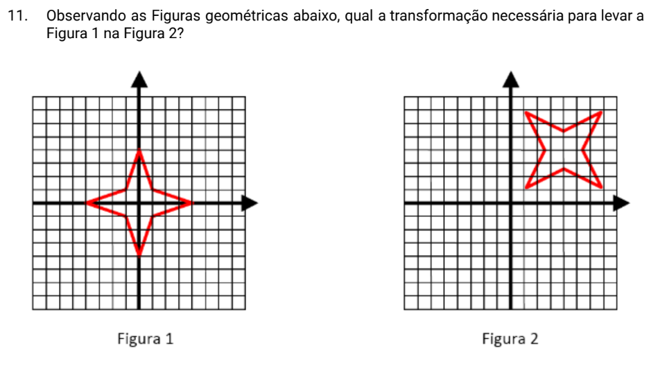

# Projeto de Visualização de Figuras

Este projeto permite a visualização de figuras geométricas 2D, com funcionalidades para movimentação e rotação utilizando o teclado. O sistema foi desenvolvido usando Python e Pygame.

## Funcionalidades

- **Visualização de figuras**: Desenha figuras geométricas baseadas em vértices fornecidos via linha de comando.
- **Movimentação**: Permite mover a figura na tela usando as setas do teclado.
- **Rotação**: Permite rotacionar a figura usando a combinação das teclas Shift e setas.

## Como Executar

Para executar este projeto, você precisa ter Python e Pygame instalados. Se não tiver Pygame instalado, você pode instalar usando pip:

```
pip install pygame
```

### Comandos para Executar

1. Clone o repositório ou baixe os arquivos `main.py` e `figura.py`.
2. Navegue até o diretório contendo os arquivos.
3. Execute o programa passando os vértices da figura como argumentos. Por exemplo:

```
python main.py 1 1 1 -1 -1 -1 -1 1
```

Este comando irá inicializar a aplicação e desenhar um quadrado na tela.

## Controles

- **Seta para esquerda/direita**: Move a figura horizontalmente.
- **Seta para cima/baixo**: Move a figura verticalmente.
- **Shift + Seta para esquerda/direita/cima/baixo**: Rotaciona a figura.

## Exercício Motivador

O exercício motivador para esse projeto está definido na seguinte imagem:



### Resolução

Para reproduzir a transformação apresentada, será necessário:
- Executar o comando:
    ```
    python main.py -4 0 -1 1 0 4 1 1 4 0 1 -1 0 -4 -1 -1
    ```
- Pressionar `seta + shift` 3 vezes;
- Pressionar `direita` 4 vezes;
- Pressionar `cima` 4 vezes.

## Dependências

- Python (versão 3.x recomendada)
- Pygame

## Licença

Este projeto é distribuído sob a licença MIT. Veja o arquivo `LICENSE` para mais detalhes.